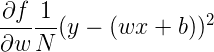
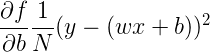

Stochastic Gradient Descent
===

This is an incremental method for stochastic approximation of an objective function optimization. Mathematically speaking, it is the sum of differentiable functions that aims to determine the minima by iteration.

In machine learning, each SGD iteration optimizes an objective function based on the value of loss. The objective function is the function that consists of the learning parameters `weights` and `biases`, hence, the quest to determine the rate of change with respect to the aforementioned variables.

For example, take the *mean squared error* (MSE) loss function,


Where `y'` represents the predicted target label given by `wx+b`, where `w` is the learning parameter `weight`,
`x` is the input data, and `b` is the learning parameter `bias`.

The parameters `w` and `b` are responsible for the actual output (prediction), so, for the SGD to adjust these
parameters, it computes the rate of change of the loss with respect to those variables, i.e.





The above derivatives compose the *gradient* that is the basis for the SGD algorithm.

The algorithm of SGD is as follows,

```
for epoch in epochs do
    set weight_gradient, bias_gradient to 0
    for index in N do
        weight_gradient += (partial derivative of MSE with respect to w)
        bias_gradient += (partial derivative of MSE with respect to b)
    # adjust the weights and biases based on the gradients
    weight = weight - (learning_rate * weight_gradient)
    bias = bias - (learning_rate * bias_gradient) 
```

With the adjusted `weights` and `biases`, get a new prediction using the linear regression equation `wx+b`. Then,
it is noticeable that the loss of the prediction changed. The `learning_rate` is an arbitrary value set to decide
how fast does the network learn. Setting this too high will make the model learn faster, but the caveat is that it may
"overshoot", i.e. miss the correct minima. On the other hand, setting this low might impede the model from learning
anything at all, i.e. stuck at some point.